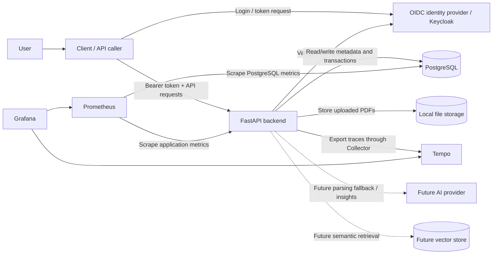
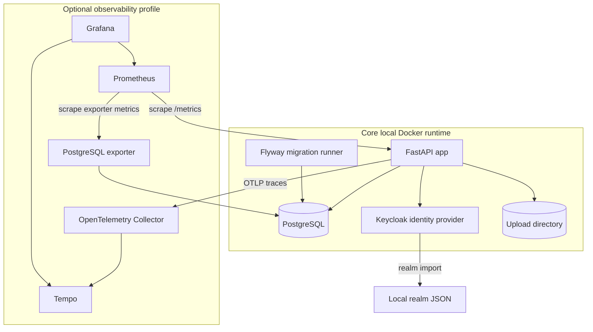
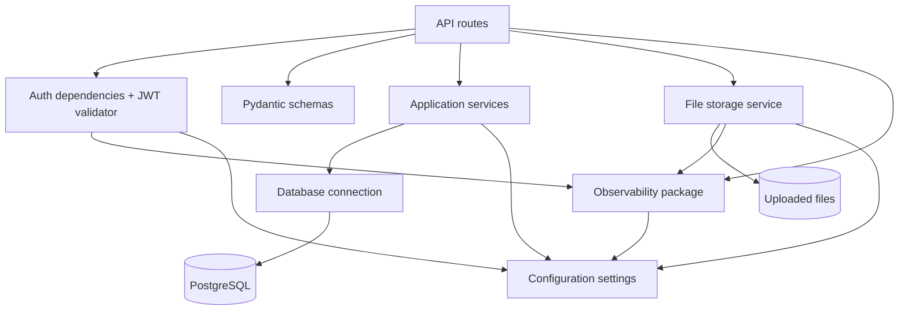
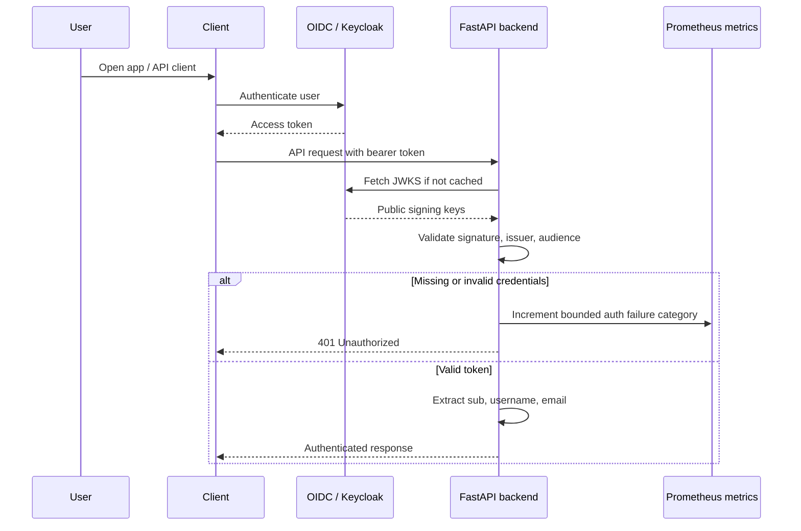
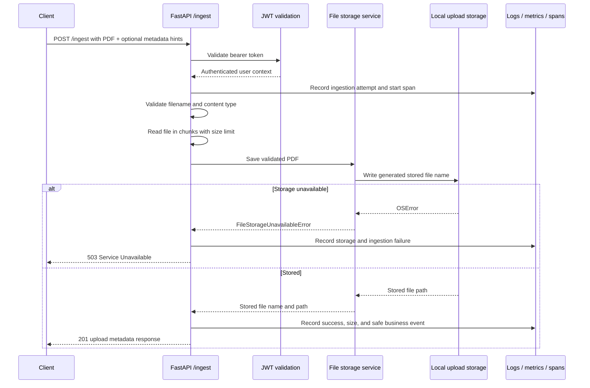
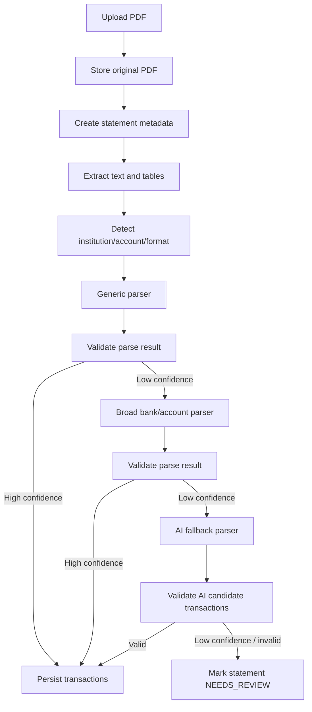
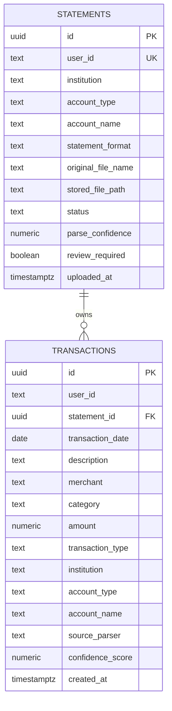
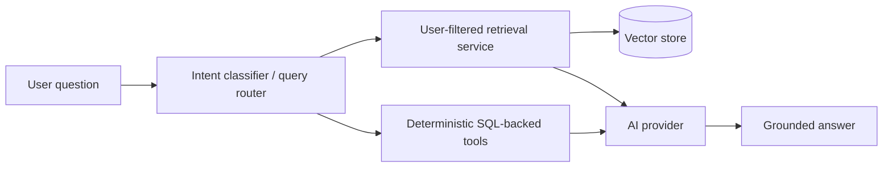
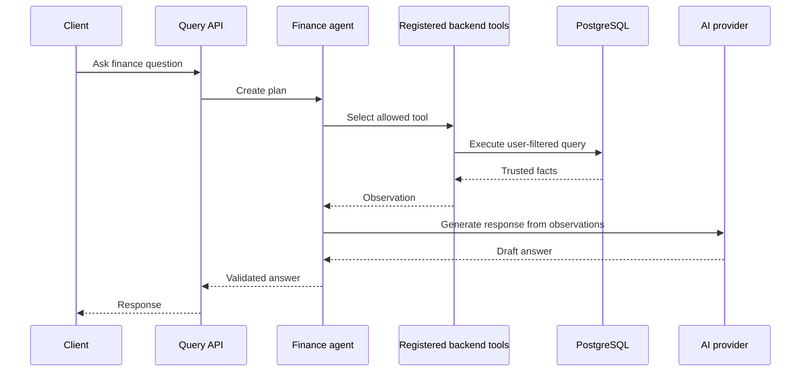

# High-Level Design (HLD) — Spend Analyzer

## 1. Purpose

This document describes the high-level architecture of Spend Analyzer.

It explains the major system components, runtime relationships, observability architecture, system boundaries, and important end-to-end flows. Detailed module-level behavior belongs in [`LLD.md`](LLD.md). Operational procedures for the local observability stack belong in [`LOCAL_OBSERVABILITY.md`](LOCAL_OBSERVABILITY.md). Parser-specific design belongs in [`PARSING_STRATEGY.md`](PARSING_STRATEGY.md).

---

## 2. Architecture Goals

Spend Analyzer is designed to be:

- Secure by default.
- Multi-user from the beginning.
- Backend-calculation-first for financial correctness.
- AI-assisted but not AI-dependent.
- Observable through structured logs, metrics, and traces.
- Containerized for local development and future cloud deployment.
- Learning-friendly, with explicit separation between current implementation and planned capabilities.

Core rule:

```text
SQL/backend calculates.
Backend validates.
AI assists and explains.
Telemetry must remain safe.
```

---

## 3. System Context Diagram



The user-facing application remains independent of the local observability backend. Metrics and traces are operational outputs; they are not required for business request processing.

---

## 4. Current Container View



Current local services:

| Service | Responsibility | Required for normal app startup |
|---|---|---:|
| `app` | FastAPI backend | Yes |
| `db` | PostgreSQL database | Yes |
| `identity-provider` | Local Keycloak/OIDC provider | Yes |
| `flyway` | Applies SQL migrations | Yes, one-shot |
| upload storage | Stores uploaded PDF files locally | Yes |
| `otel-collector` | Receives, batches, and forwards OTLP traces | No |
| `prometheus` | Scrapes and stores application/database metrics | No |
| `grafana` | Explores metrics and traces | No |
| `tempo` | Stores local traces | No |
| `postgres-exporter` | Exposes PostgreSQL operational metrics | No |

The optional services start only with:

```text
docker compose --profile observability up --build -d
```

---

## 5. Backend Component Diagram



Current implemented route modules:

| Module | Responsibility |
|---|---|
| `health_routes.py` | Application and database health checks |
| `me_routes.py` | Authenticated user details |
| `ingest_routes.py` | Authenticated PDF upload |

Current observability modules:

| Module | Responsibility |
|---|---|
| `observability/context.py` | Request, trace, and span correlation context |
| `observability/logging.py` | Structured JSON logging and safe processors |
| `observability/middleware.py` | Request ID and request outcome summary |
| `observability/metrics.py` | HTTP, application, dependency, auth, storage, and ingestion metrics |
| `observability/tracing.py` | OpenTelemetry setup and safe manual span helpers |

Planned component additions:

| Component | Responsibility |
|---|---|
| `repositories/` | Database access abstractions |
| `parsing/` | PDF extraction, statement detection, transaction parsing |
| `ai/` | AI provider abstraction and structured-output utilities |
| `rag/` | Chunking, embeddings, retrieval, context building |
| `agents/` | Controlled tool-based finance agent |

---

## 6. Observability Architecture

### 6.1 Signal flows

```text
Logs:
FastAPI -> structured JSON -> container stdout

Metrics:
FastAPI /metrics -------------------+
                                     +-> Prometheus -> Grafana
PostgreSQL exporter /metrics -------+

Traces:
FastAPI -> OTLP -> OpenTelemetry Collector -> Tempo -> Grafana
```

Prometheus directly scrapes Prometheus-format metrics. The Collector is used for trace transport, batching, and backend routing; it is not a metrics database.

### 6.2 Request correlation

Each request has:

- `request_id`: client-facing support identifier returned through `X-Request-ID`;
- `trace_id`: distributed trace identifier when tracing is enabled;
- `span_id`: current operation identifier when tracing is enabled.

Request, trace, and span IDs are log fields only. They are never metric labels.

### 6.3 Safe telemetry boundary

Telemetry must not contain:

- passwords, tokens, API keys, or authorization headers;
- database URLs or credentials;
- raw exception messages or stack traces;
- original filenames when they may be sensitive;
- statement contents or extracted text;
- account numbers, card numbers, or user-provided financial descriptions;
- SQL text or bind values.

The application records bounded failure categories and exception class names instead of uncontrolled exception payloads.

### 6.4 Centralized log search

OpenSearch, Elasticsearch/ELK, and Loki are intentionally deferred. Structured JSON logs to stdout are sufficient for the current MVP. A centralized log backend should be added only when retention, multi-instance search, or incident investigation needs justify its operational cost.

---

## 7. Authentication Flow



Security rules:

- Backend derives `user_id` from token `sub`.
- Backend never accepts user ownership from request payload.
- Protected routes require a valid bearer token.
- JWT issuer and audience must match configured values.
- Authentication metrics use only bounded categories such as `missing_credentials` and `credentials_invalid`.
- Token contents and validation messages are never telemetry fields.

---

## 8. Current Statement Upload Flow



Current behavior:

- The API authenticates the caller.
- The API validates and stores a PDF statement.
- Oversized uploads return 413.
- Invalid uploads return 400.
- Storage availability failures return 503.
- The API records bounded ingestion outcomes without filenames or user IDs.
- Statement metadata persistence and parsing integration are planned next steps.

For the exact API contract and module behavior, see [`LLD.md`](LLD.md).

---

## 9. Future Full Ingestion and Parsing Flow



Design rules:

- Generic parser runs before specialized parser.
- Bank/account parser should be broad, not card-product-specific, unless necessary.
- AI fallback is candidate extraction only.
- Backend validation decides whether data can be persisted.
- Each meaningful future stage must evaluate safe logs, bounded metrics, and span boundaries using the existing observability foundation.

Detailed parser design is maintained in [`PARSING_STRATEGY.md`](PARSING_STRATEGY.md).

---

## 10. Current Database ERD



Important data-isolation rule:

```text
transactions(statement_id, user_id) references statements(id, user_id)
```

This prevents a transaction for one user from referencing another user's statement.

Database observability currently uses:

- application dependency-health metrics;
- the `database.health_check` child span;
- PostgreSQL exporter connection, activity, lock, and database metrics.

Future repository work may add DB spans or slow-query instrumentation, but it must not record SQL text, bind values, credentials, or financial data.

---

## 11. Future AI and RAG Architecture



Rules:

- SQL/backend tools provide financial numbers.
- RAG retrieves context only for the authenticated user.
- AI generates explanation from trusted facts and retrieved context.
- AI must not execute raw SQL.
- AI must not calculate final financial totals.
- Prompts, retrieved financial content, and model responses must not be logged by default.

---

## 12. Future Controlled Agent Flow



Agent boundary:

```text
The agent can call predefined tools only.
The agent cannot directly access repositories or execute arbitrary SQL.
```

---

## 13. Deployment View

### 13.1 Current local deployment

```text
Docker Compose
├── app
├── db
├── identity-provider
├── flyway
├── upload storage
└── observability profile
    ├── otel-collector
    ├── prometheus
    ├── grafana
    ├── tempo
    └── postgres-exporter
```

The observability profile is optional. The application must start and process requests when it is disabled.

### 13.2 Future cloud mapping

| Local component | Future cloud equivalent |
|---|---|
| FastAPI app container | ECS, Kubernetes, or equivalent |
| PostgreSQL container | Managed PostgreSQL |
| Local upload directory | Object storage |
| Local Keycloak | Managed or self-hosted OIDC provider |
| Prometheus | Managed Prometheus-compatible metrics backend |
| Tempo | Managed or self-hosted trace backend |
| OpenTelemetry Collector | Sidecar, daemon, or gateway Collector |
| Grafana | Managed or self-hosted visualization |
| Docker Compose | Infrastructure as code / orchestration |
| Local env file | Secret and parameter management |

Before cloud deployment, introduce a storage abstraction so local filesystem and object storage use the same service interface.

---

## 14. HLD vs LLD Responsibility

| Document | Responsibility |
|---|---|
| `HLD.md` | Major components, system interactions, runtime and observability views, sequence diagrams, ERD, deployment view |
| `LLD.md` | Module details, API contracts, configuration, telemetry behavior, validations, table details, service/repository rules |
| `LOCAL_OBSERVABILITY.md` | Local startup, metric/trace inspection, request-ID debugging, and telemetry safety procedures |
| `PARSING_STRATEGY.md` | Parser-specific design, confidence strategy, AI fallback, and manual review policy |
| `LEARNING_GUIDE.md` | Learning objectives, learning phases, issue-quality expectations |
| `PROJECT_REQUIREMENTS.md` | Product scope, functional requirements, non-functional requirements |

---

## 15. Current Design Summary

Current backend foundation:

```text
FastAPI
+ Keycloak/OIDC
+ PostgreSQL/Flyway
+ local PDF upload
+ structured logs
+ Prometheus metrics
+ OpenTelemetry traces
+ optional local observability stack
+ strict CI gates
```

Next product architecture step:

```text
Persist statement metadata, then add PDF extraction and parsing pipeline.
```

Future feature work must reuse the current observability helpers rather than creating new middleware, metric registries, or tracing providers.
