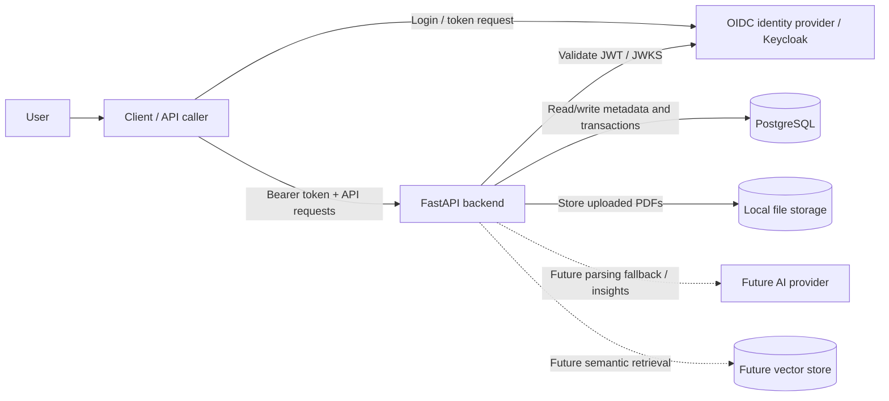
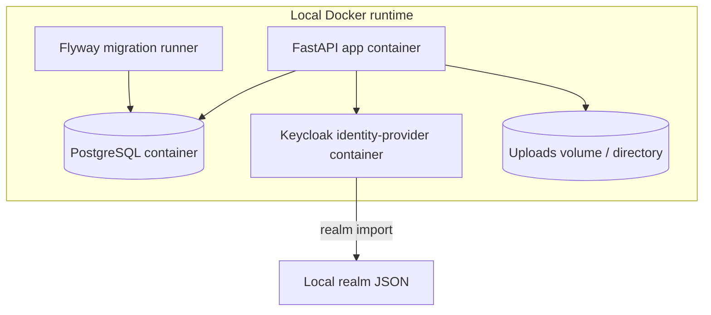
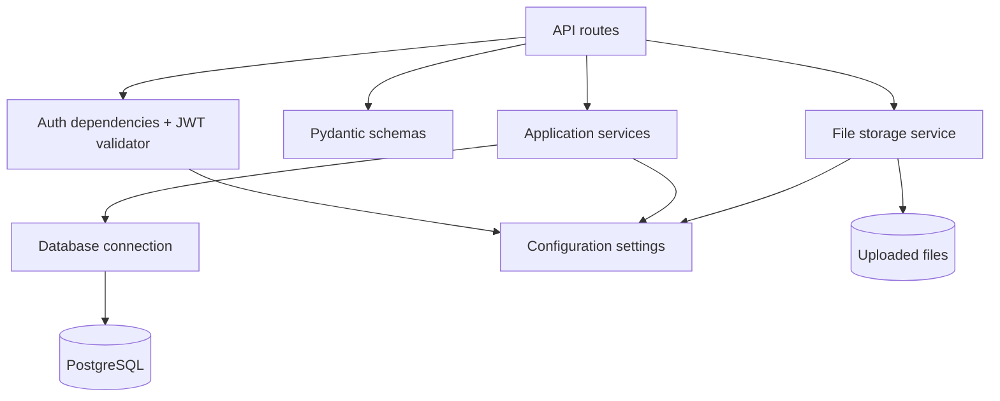
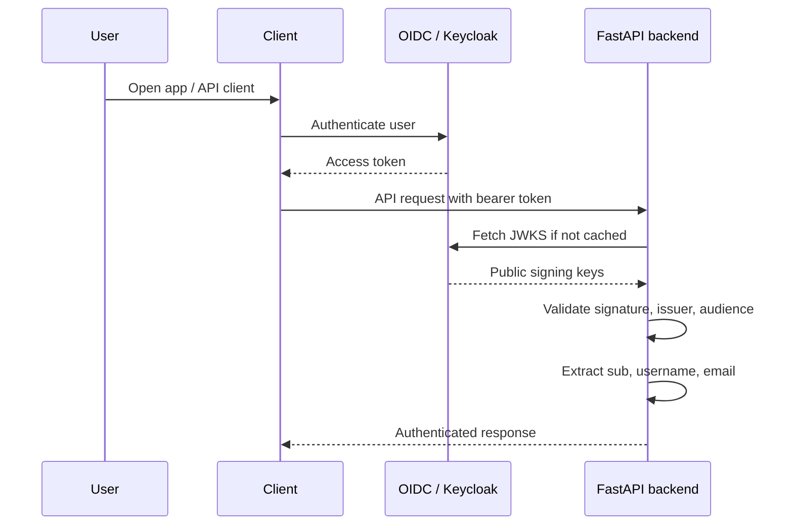
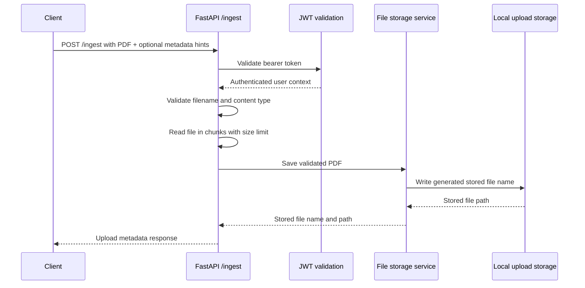
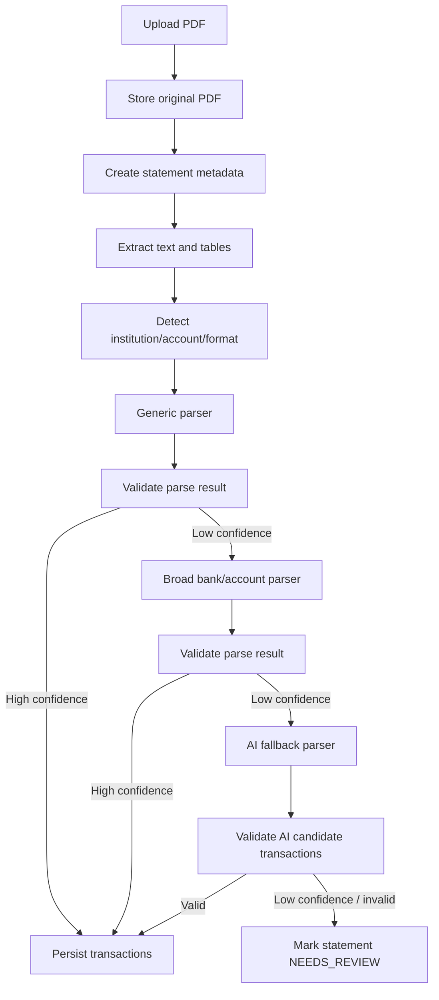
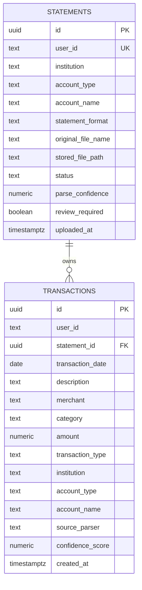
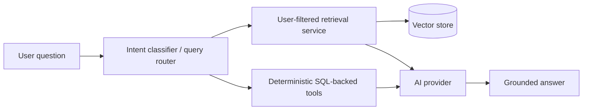
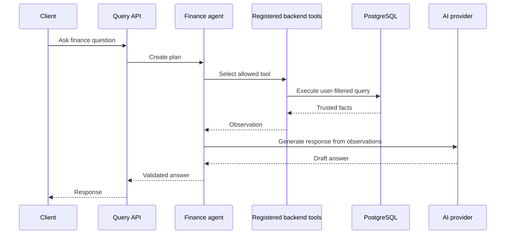

# High-Level Design (HLD) — Spend Analyzer

## 1. Purpose

This document describes the high-level architecture of Spend Analyzer.

The HLD explains the major system components, runtime relationships, system boundaries, and important end-to-end flows. Detailed module-level behavior belongs in [`LLD.md`](LLD.md). Parser-specific design belongs in [`PARSING_STRATEGY.md`](PARSING_STRATEGY.md).

---

## 2. Architecture Goals

Spend Analyzer is designed to be:

- Secure by default.
- Multi-user from the beginning.
- Backend-calculation-first for financial correctness.
- AI-assisted but not AI-dependent.
- Containerized for local development and future cloud deployment.
- Learning-friendly, with explicit separation between current implementation and planned capabilities.

Core rule:

```text
SQL/backend calculates.
Backend validates.
AI assists and explains.
```

---

## 3. System Context Diagram



---

## 4. Current Container View



Current local services:

| Service | Responsibility |
|---|---|
| `app` | FastAPI backend |
| `db` | PostgreSQL database |
| `identity-provider` | Local Keycloak/OIDC provider |
| migration runner | Applies SQL migrations under `infra/db/migration` |
| upload storage | Stores uploaded PDF files locally |

---

## 5. Backend Component Diagram



Current implemented route modules:

| Module | Responsibility |
|---|---|
| `health_routes.py` | Application and database health checks |
| `me_routes.py` | Authenticated user details |
| `ingest_routes.py` | Authenticated PDF upload |

Planned component additions:

| Component | Responsibility |
|---|---|
| `repositories/` | Database access abstractions |
| `parsing/` | PDF extraction, statement detection, transaction parsing |
| `ai/` | AI provider abstraction and structured-output utilities |
| `rag/` | Chunking, embeddings, retrieval, context building |
| `agents/` | Controlled tool-based finance agent |

---

## 6. Authentication Flow



Security rules:

- Backend derives `user_id` from token `sub`.
- Backend never accepts user ownership from request payload.
- Protected routes require a valid bearer token.
- JWT issuer and audience must match configured values.

---

## 7. Current Statement Upload Flow



Current behavior:

- The API authenticates the caller.
- The API validates and stores a PDF statement.
- The API returns upload metadata.
- Statement metadata persistence and parsing integration are planned next steps.

For the exact API contract, request fields, response shape, and status-code behavior, see [`LLD.md`](LLD.md).

---

## 8. Future Full Ingestion and Parsing Flow



Design rules:

- Generic parser runs before specialized parser.
- Bank/account parser should be broad, not card-product-specific, unless necessary.
- AI fallback is candidate extraction only.
- Backend validation decides whether data can be persisted.

Detailed parser design is maintained in [`PARSING_STRATEGY.md`](PARSING_STRATEGY.md).

---

## 9. Current Database ERD



Important data-isolation rule:

```text
transactions(statement_id, user_id) references statements(id, user_id)
```

This prevents a transaction for one user from referencing another user's statement.

Detailed table definitions, constraints, and indexes are maintained in [`LLD.md`](LLD.md).

---

## 10. Future AI and RAG Architecture



Rules:

- SQL/backend tools provide financial numbers.
- RAG retrieves context only for the authenticated user.
- AI generates explanation from trusted facts and retrieved context.
- AI must not execute raw SQL.
- AI must not calculate final financial totals.

---

## 11. Future Controlled Agent Flow



Agent boundary:

```text
The agent can call predefined tools only.
The agent cannot directly access repositories or execute arbitrary SQL.
```

---

## 12. Deployment View

### Current local deployment

```text
Docker Compose
├── app
├── db
├── identity-provider
└── migration runner
```

### Future AWS mapping

| Local component | Future AWS equivalent |
|---|---|
| FastAPI app container | ECS / EC2 |
| PostgreSQL container | RDS PostgreSQL |
| Local upload directory | S3 |
| Local Keycloak | Managed or self-hosted OIDC provider |
| Docker Compose | ECS task definitions / IaC |
| Local env file | Secrets Manager / Parameter Store |

Before cloud deployment, introduce a storage abstraction so local filesystem and S3 use the same service interface.

---

## 13. HLD vs LLD Responsibility

| Document | Responsibility |
|---|---|
| `HLD.md` | Major components, system interactions, runtime view, sequence diagrams, ERD, deployment view |
| `LLD.md` | Module details, current API contracts, configuration, validations, table details, service/repository rules |
| `PARSING_STRATEGY.md` | Parser-specific design, confidence strategy, AI fallback and manual review policy |
| `LEARNING_GUIDE.md` | Learning objectives, learning phases, issue-quality expectations |
| `PROJECT_REQUIREMENTS.md` | Product scope, functional requirements, non-functional requirements |

---

## 14. Current Design Summary

Current backend foundation:

```text
FastAPI + Keycloak/OIDC + PostgreSQL + Flyway + local PDF upload + strict CI gates
```

Next architectural step:

```text
Persist statement metadata, then add PDF extraction and parsing pipeline.
```
