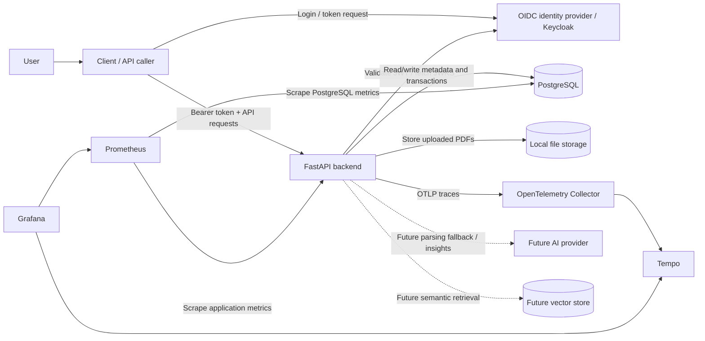
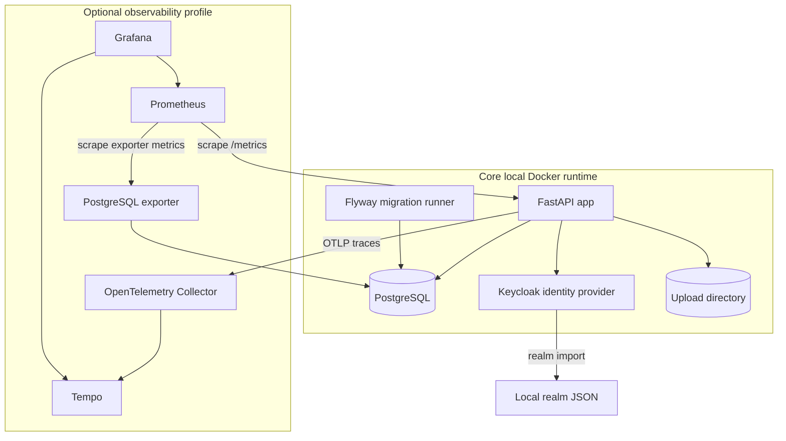
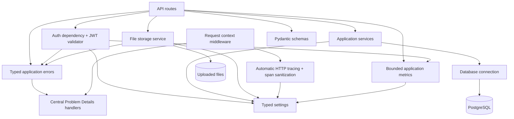
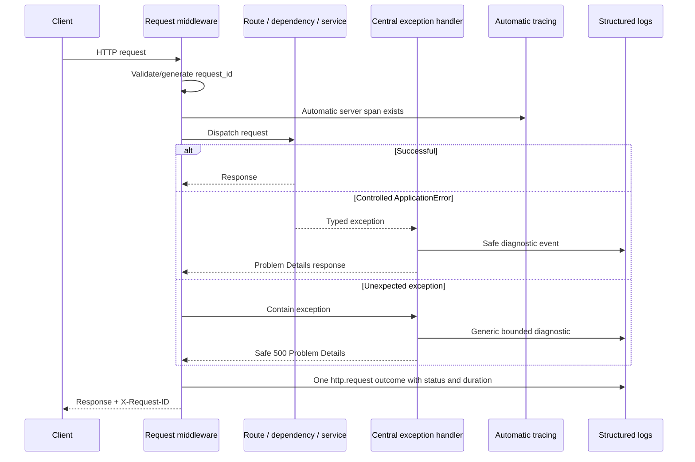
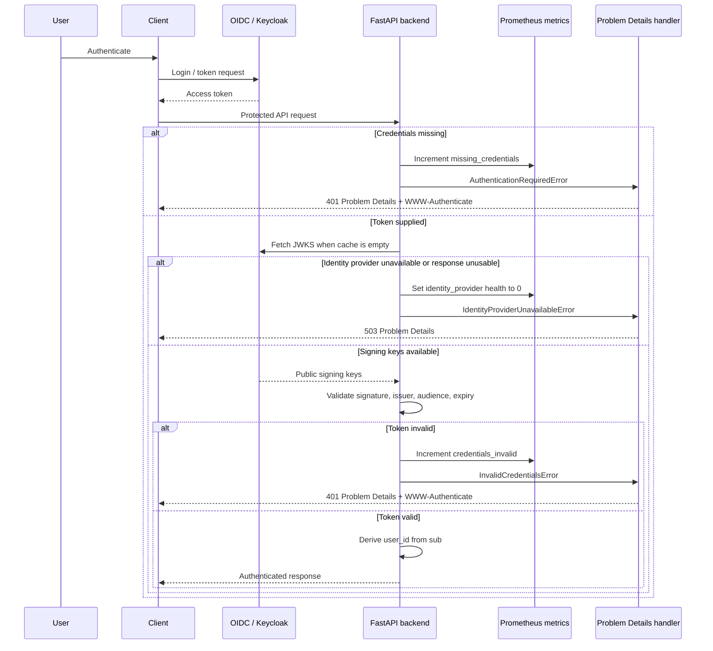
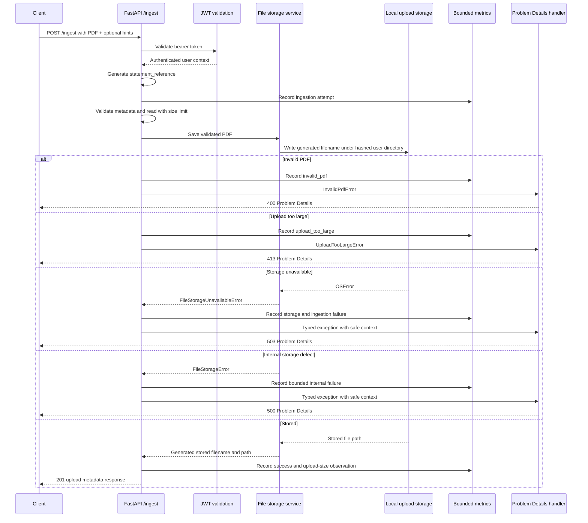
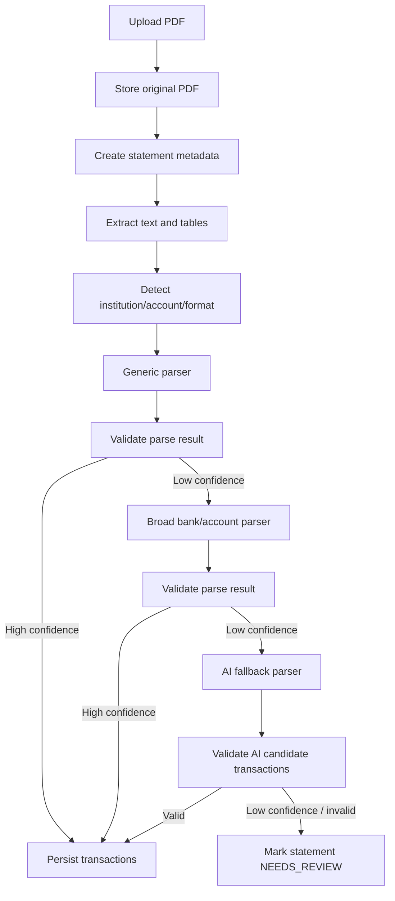
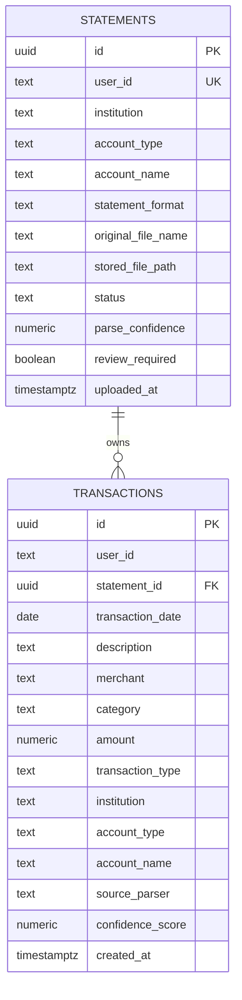
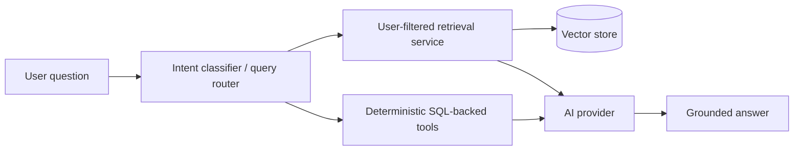
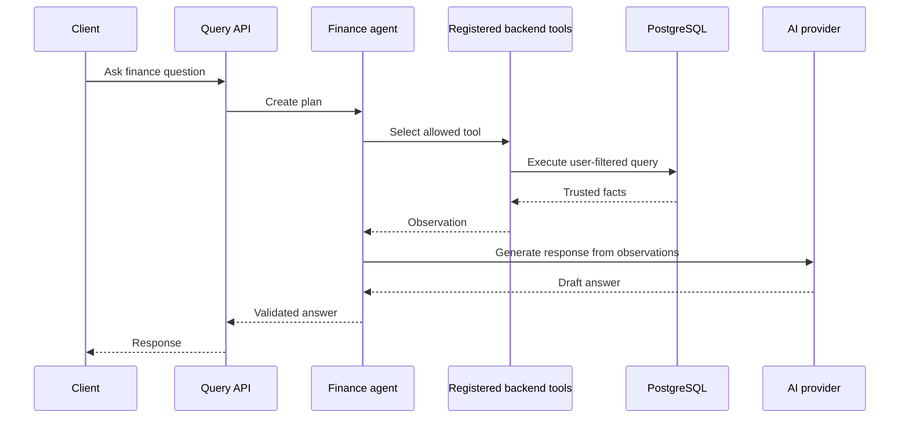

# High-Level Design (HLD) — Spend Analyzer

## 1. Purpose

This document describes the high-level architecture of Spend Analyzer.

It covers the major system components, runtime relationships, observability architecture, system boundaries, and important end-to-end flows. Detailed module behavior belongs in [`LLD.md`](LLD.md). Observability implementation decisions belong in [`OBSERVABILITY_LLD.md`](OBSERVABILITY_LLD.md). Operational procedures belong in [`LOCAL_OBSERVABILITY.md`](LOCAL_OBSERVABILITY.md). Parser-specific design belongs in [`PARSING_STRATEGY.md`](PARSING_STRATEGY.md).

---

## 2. Architecture Goals

Spend Analyzer is designed to be:

- secure by default;
- multi-user from the beginning;
- backend-calculation-first for financial correctness;
- AI-assisted but not AI-dependent;
- observable through structured logs, bounded metrics, and safe traces;
- containerized for local development and future cloud deployment;
- learning-friendly, with explicit separation between current and planned capabilities.

Core rule:

```text
SQL/backend calculates.
Backend validates.
AI assists and explains.
Telemetry must remain safe.
```

---

## 3. System Context Diagram



The user-facing application remains independent of the optional local observability backend. Metrics and traces are operational outputs and are not required for business request processing.

---

## 4. Current Container View



| Service | Responsibility | Required for normal startup |
|---|---|---:|
| `app` | FastAPI backend | Yes |
| `db` | PostgreSQL database | Yes |
| `identity-provider` | Local Keycloak/OIDC provider | Yes |
| `flyway` | Applies SQL migrations | Yes, one-shot |
| upload storage | Stores uploaded PDFs locally | Yes |
| `otel-collector` | Receives, batches, and forwards OTLP traces | No |
| `prometheus` | Scrapes and stores application/database metrics | No |
| `grafana` | Explores metrics and traces | No |
| `tempo` | Stores local traces | No |
| `postgres-exporter` | Exposes PostgreSQL operational metrics | No |

The optional services start with:

```text
docker compose --profile observability up --build -d
```

---

## 5. Backend Component Diagram



Application routes and services do not create OpenTelemetry spans. They raise typed failures and record bounded business metrics where aggregation is useful. Common infrastructure owns request correlation, HTTP outcome logging, Problem Details conversion, and HTTP tracing.

### 5.1 Current route modules

| Module | Responsibility |
|---|---|
| `health_routes.py` | Application and database health checks |
| `me_routes.py` | Authenticated user details |
| `ingest_routes.py` | Authenticated PDF upload |

### 5.2 Current cross-cutting modules

| Module | Responsibility |
|---|---|
| `errors.py` | Typed controlled application failures and safe diagnostic context |
| `http.py` | Route-template resolution and safe request/URL sanitization |
| `problem_details.py` | Central exception mapping, diagnostic logging, and RFC 9457-compatible responses |
| `observability/context.py` | Request correlation context |
| `observability/logging.py` | Structured JSON logging and safe processors |
| `observability/middleware.py` | Request ID, duration, exception containment, and one HTTP outcome log |
| `observability/metrics.py` | HTTP, application, dependency, auth, storage, and ingestion metrics |
| `observability/tracing.py` | Automatic FastAPI/outbound HTTP tracing and pre-export span sanitization |

### 5.3 Planned component additions

| Component | Responsibility |
|---|---|
| `repositories/` | Database access abstractions |
| `parsing/` | PDF extraction, statement detection, and transaction parsing |
| `ai/` | AI provider abstraction and structured-output utilities |
| `rag/` | Chunking, embeddings, retrieval, and context construction |
| `agents/` | Controlled tool-based finance agent |

---

## 6. Observability Architecture

### 6.1 Signal flows

```text
Logs:
FastAPI -> structured JSON -> container stdout

Metrics:
FastAPI /metrics -------------------+
                                     +-> Prometheus -> Grafana
PostgreSQL exporter /metrics -------+

Traces:
FastAPI automatic spans
    -> sanitizing span processor
    -> OTLP
    -> OpenTelemetry Collector
    -> Tempo
    -> Grafana
```

Prometheus directly scrapes Prometheus-format metrics. The Collector transports and batches traces; it is not a metrics database.

### 6.2 Request lifecycle



The middleware owns request-wide mechanics. Typed exceptions describe controlled failures. Central handlers own error mapping and diagnostic logs. Automatic instrumentation owns HTTP spans.

### 6.3 Request correlation

Each request can have:

- `request_id`: client-facing support identifier returned through `X-Request-ID`;
- `trace_id`: distributed trace identifier when tracing is enabled;
- `span_id`: current span identifier when tracing is enabled.

Request, trace, and span identifiers are log fields only. They are never Prometheus labels.

### 6.4 Safe request target

Request logs, Problem Details, and server-span HTTP attributes use:

- route templates instead of concrete dynamic path values;
- bounded query parameter names;
- `[REDACTED]` for every query value;
- no scheme, host, port, fragment, headers, or body.

Examples:

```text
/items/{item_id}
/items/{item_id}?source=%5BREDACTED%5D
/<unmatched>?source=%5BREDACTED%5D
```

### 6.5 Safe telemetry boundary

Telemetry must not contain:

- passwords, tokens, API keys, authorization headers, or identity claims;
- raw user identifiers, usernames, or email addresses;
- database URLs, credentials, SQL, or bind values;
- concrete dynamic path values or query values;
- raw exception messages or stack traces;
- original sensitive filenames;
- statement contents, extracted text, account numbers, card numbers, or user-provided financial descriptions;
- identity-provider payloads or provider URLs in generic outbound traces.

The application records bounded categories, exception class names, generated statement references, sizes, counts, and configured limits where operationally useful.

### 6.6 Tracing decision

Issue #78 uses automatic infrastructure tracing:

- `FastAPIInstrumentor` creates incoming server spans;
- `RequestsInstrumentor` creates supported outbound HTTP client spans;
- configured identity-provider issuer and JWKS endpoints are excluded from generic outbound tracing;
- completed spans are sanitized before batching and OTLP export;
- application routes and services do not import OpenTelemetry or create manual spans;
- future business/dependency spans require a separate design decision.

### 6.7 Centralized log search

OpenSearch, Elasticsearch/ELK, and Loki are deferred. Structured JSON logs to stdout are sufficient for the current MVP. A centralized backend should be added only when retention, multi-instance search, or incident-investigation needs justify its operational cost.

---

## 7. Authentication Flow



Security rules:

- backend ownership is derived from token `sub`;
- the backend never accepts user ownership from request payload;
- protected routes require a valid bearer token;
- issuer and audience must match configured values;
- invalid credentials and identity-provider outages are separate operational categories;
- identity-provider unavailability returns `503` and does not increment authentication-failure metrics;
- tokens, claims, key IDs, provider payloads, and raw validation messages are not telemetry fields.

---

## 8. Current Statement Upload Flow



Current behavior:

- authentication is required;
- metadata and PDF-like content are validated;
- the upload is read in bounded chunks with a configured limit;
- generated storage paths do not use the original filename or raw user ID;
- oversized uploads return `413`;
- invalid PDFs return `400`;
- storage availability failures return `503`;
- unexpected internal storage failures return a safe `500`;
- metrics use bounded categories;
- the route emits one meaningful success business event;
- the incoming request is traced automatically; the route does not create a manual ingestion span;
- statement metadata persistence and parsing integration are planned next.

---

## 9. Future Full Ingestion and Parsing Flow



Design rules:

- generic parsing precedes specialized parsing;
- bank/account parsers should be broad rather than product-specific unless necessary;
- AI fallback produces candidate data only;
- backend validation decides whether data can be persisted;
- every future stage must deliberately choose baseline telemetry, a structured event, bounded metrics, a justified custom span, or no additional telemetry.

Detailed parser design is maintained in [`PARSING_STRATEGY.md`](PARSING_STRATEGY.md).

---

## 10. Current Database ERD



Ownership rule:

```text
transactions(statement_id, user_id) references statements(id, user_id)
```

This prevents one user's transaction from referencing another user's statement.

Database observability currently uses:

- the automatic incoming request trace for `/health/db`;
- the bounded database dependency-health gauge;
- PostgreSQL exporter connection, activity, lock, and database metrics.

There is no manual `database.health_check` child span. Future repository work may add database instrumentation only after dependency compatibility, query patterns, and sanitization rules are validated. SQL, bind values, credentials, and financial data must never be recorded.

---

## 11. Future AI and RAG Architecture



Rules:

- SQL/backend tools provide financial numbers;
- retrieval is filtered by authenticated `user_id`;
- AI generates explanations from trusted facts and retrieved context;
- AI must not execute raw SQL;
- AI must not calculate final financial totals;
- prompts, retrieved financial content, and model responses are not logged by default.

---

## 12. Future Controlled Agent Flow



Agent boundary:

```text
The agent can call predefined tools only.
The agent cannot directly access repositories or execute arbitrary SQL.
```

---

## 13. Deployment View

### 13.1 Current local deployment

```text
Docker Compose
├── app
├── db
├── identity-provider
├── flyway
├── upload storage
└── observability profile
    ├── otel-collector
    ├── prometheus
    ├── grafana
    ├── tempo
    └── postgres-exporter
```

The observability profile is optional. The application must start and process requests when it is disabled.

### 13.2 Future cloud mapping

| Local component | Future cloud equivalent |
|---|---|
| FastAPI app container | ECS, Kubernetes, or equivalent |
| PostgreSQL container | Managed PostgreSQL |
| Local upload directory | Object storage |
| Local Keycloak | Managed or self-hosted OIDC provider |
| Prometheus | Managed Prometheus-compatible backend |
| Tempo | Managed or self-hosted trace backend |
| OpenTelemetry Collector | Sidecar, daemon, or gateway Collector |
| Grafana | Managed or self-hosted visualization |
| Docker Compose | Infrastructure as code / orchestration |
| Local env file | Secret and parameter management |

Before cloud deployment, introduce a storage abstraction so local filesystem and object storage implementations share the same service contract.

---

## 14. Documentation Responsibility

| Document | Responsibility |
|---|---|
| `HLD.md` | Major components, interactions, runtime views, major flows, ERD, and deployment view |
| `LLD.md` | Module details, API contracts, validation, error handling, and service/repository rules |
| `OBSERVABILITY_LLD.md` | Detailed logging, metrics, tracing, correlation, and telemetry-safety decisions |
| `LOCAL_OBSERVABILITY.md` | Local startup, metric/trace inspection, request-ID debugging, and runbooks |
| `PARSING_STRATEGY.md` | Parser strategy, confidence policy, AI fallback, and manual review |
| `LEARNING_GUIDE.md` | Learning objectives, phases, and issue-quality expectations |
| `PROJECT_REQUIREMENTS.md` | Product scope and functional/non-functional requirements |

---

## 15. Current Design Summary

```text
FastAPI
+ centralized typed error handling and Problem Details
+ Keycloak/OIDC
+ PostgreSQL/Flyway
+ secure local PDF upload
+ structured request-correlated logs
+ bounded Prometheus metrics
+ automatically generated and sanitized OpenTelemetry traces
+ optional local observability stack
+ strict CI gates
```

Next product architecture step:

```text
Persist statement metadata, then add PDF extraction and the parsing pipeline.
```

Future feature work must reuse the current request correlation, error handling, metric registry, and tracing provider rather than creating parallel infrastructure.
